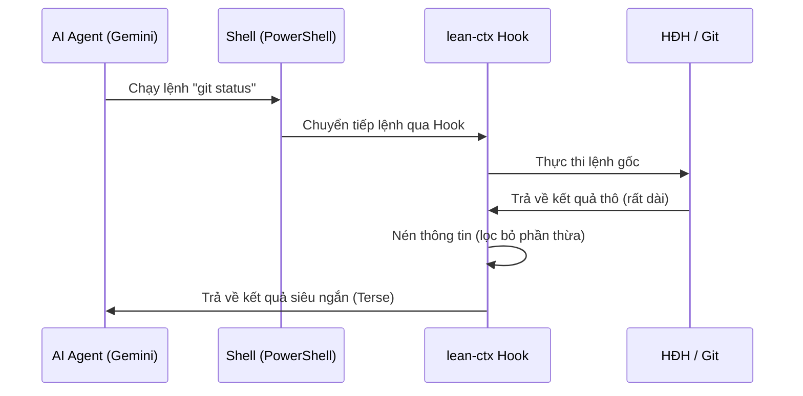

# Phần 2: Kiến trúc & Cơ chế hoạt động của lean-ctx

> [!TIP]
> Mục này giải thích cách lean-ctx xử lý dữ liệu ở hậu trường để thuyết phục người nghe về tính khoa học và thực tiễn của công cụ.

---

## 1. Cơ chế 1: Nén Đọc File (File Read Compression)
Thay vì nạp toàn bộ file văn bản, `lean-ctx` cung cấp các **chế độ đọc thông minh** bằng cách sử dụng thư viện **Tree-sitter** để trích xuất cú pháp:

| Chế độ (Mode) | Mô tả | Mức độ tiết kiệm Token |
| :--- | :--- | :--- |
| `auto` | Tự động lựa chọn chế độ tối ưu nhất | Linh hoạt |
| `full` | Đọc toàn bộ nội dung file (lần đầu), các lần đọc lại chỉ tốn **13 token** | 90%++ cho re-reads |
| `map` | Chỉ lấy đồ thị phụ thuộc (dependency graph) và API signatures | ~80% |
| `signatures` | Trích xuất AST (chỉ lấy khai báo hàm, struct, interface) | ~75% |
| `entropy` | Chỉ lấy các dòng code có mật độ thông tin (entropy) cao nhất | ~85% |
| `diff` | Chỉ đọc các dòng code có sự thay đổi so với bản trước đó | 95%++ |

---

## 2. Cơ chế 2: Nén Đầu Ra Command Line (Shell Hook Compression)
Khi AI thực hiện các lệnh shell thông qua terminal, `lean-ctx` sẽ chặn (intercept) và rút gọn dữ liệu trả về trước khi nạp vào bộ nhớ ngữ cảnh của AI.

### Ví dụ thực tế với `git status`:
* **Không dùng lean-ctx:** Trả về toàn bộ danh sách file chưa commit kèm theo các câu hướng dẫn chi tiết của git (tốn ~300 - 500 tokens).
* **Có dùng lean-ctx:** Nén lại thành sơ đồ trạng thái cực ngắn (chỉ tốn ~20 - 30 tokens).

---

## 3. Cơ chế 3: Tối ưu phản hồi của AI (Terse Response Prompting)
Bằng cách thiết lập cấu hình `lean-ctx terse max`, công cụ sẽ chèn một tập quy tắc hành vi (Agent Instructions) vào hệ thống:
* Ép AI phải trả lời ngắn gọn theo phong cách **Expert-Terse** (sử dụng ngôn ngữ ký hiệu, bỏ giới từ/mạo từ thừa).
* Đảm bảo cấu trúc code giữ nguyên 100% nhưng toàn bộ phần giải thích dông dài bị lược bỏ.
* **Tiết kiệm từ 25% – 65% token phản hồi** từ phía AI Agent.
