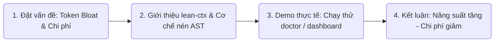

# Phần 4: Các mẫu thực hành tốt nhất (Best Practices) & Mẹo nâng cao

> [!TIP]
> Phần này giúp người nghe biết cách áp dụng lean-ctx vào công việc hàng ngày một cách thông minh và chuyên nghiệp nhất.

---

## 1. Kết hợp chế độ Đọc thích hợp (Context Engineering)
Đừng luôn luôn để AI đọc ở chế độ mặc định. Hãy chủ động điều phối AI sử dụng chế độ đọc phù hợp với từng tác vụ:

* **Tác vụ 1: Đọc hiểu kiến trúc toàn cục (Global Architecture)**
  * 👉 Yêu cầu AI dùng chế độ **`map`** hoặc **`signatures`**.
  * *Lợi ích:* Chỉ tốn 20% token so với đọc toàn bộ file nhưng AI vẫn nắm được đầy đủ cấu trúc API, các class và mối liên kết.

* **Tác vụ 2: Sửa bug ở một phạm vi nhỏ (Local Bug Fix)**
  * 👉 Yêu cầu AI sử dụng chế độ **`lines:N-M`** (ví dụ: `lines:40-80`).
  * *Lợi ích:* AI chỉ tập trung vào đúng đoạn code lỗi, tránh nạp hàng ngàn dòng code xung quanh không liên quan.

* **Tác vụ 3: Đọc lại file cũ (Re-reading)**
  * 👉 Cơ chế **caching** của `lean-ctx` sẽ tự động chuyển đổi file đọc lại thành một token tham chiếu siêu nhỏ (~13 token). Bạn không cần làm gì cả, hệ thống tự tối ưu!

---

## 2. Loại bỏ các thư mục "rác" khỏi Context (`config.toml`)
Mặc dù `lean-ctx` rất thông minh, bạn vẫn nên cấu hình rõ ràng các thư mục cần bỏ qua trong `C:\Users\Sieu chu nhiem\.lean-ctx\config.toml` hoặc `.gitignore` để AI không quét nhầm:
* Các thư mục bản dựng: `dist/`, `build/`, `out/`, `.next/`
* Thư mục thư viện: `node_modules/`, `venv/`, `.gemini/`
* Các tệp tin lớn không chứa mã nguồn: ảnh, video, dữ liệu nén `.zip`, `.tar`.

---

## 3. Theo dõi "Chỉ số Sức khỏe" Token định kỳ
Hãy biến việc kiểm tra token tiết kiệm thành thói quen:
1. Cuối ngày làm việc, chạy lệnh `lean-ctx gain` để xem mình đã tiết kiệm được bao nhiêu Token.
2. Trình diễn kết quả này cho Tech Lead hoặc Team để thấy được năng suất và mức độ tối ưu hóa chi phí của bạn.

---

## 4. Kịch bản Thuyết trình Gợi ý (Speech Structure)
Nếu bạn chuẩn bị nói về chủ đề này trước đám đông, đây là khung sườn lý tưởng:

1. **Mở đầu (1 phút):** Chia sẻ nỗi đau của việc AI hết dung lượng context hoặc câu trả lời bị chậm khi dự án phình to.
2. **Giải pháp (2 phút):** Giới thiệu `lean-ctx` và giải thích cơ chế nén bằng AST (Tree-sitter) giúp giảm lượng dữ liệu thừa.
3. **Demo Trực quan (3 phút):**
   * Mở terminal chạy `lean-ctx doctor` để thấy hệ thống tích hợp sâu thế nào.
   * Chạy `lean-ctx dashboard` để show giao diện Web Dashboard cực kỳ trực quan với các biểu đồ tiết kiệm đô-la thực tế.
4. **Kết luận (1 phút):** Tóm tắt lợi ích: Code nhanh hơn, thông minh hơn, tiết kiệm chi phí API vượt trội.
