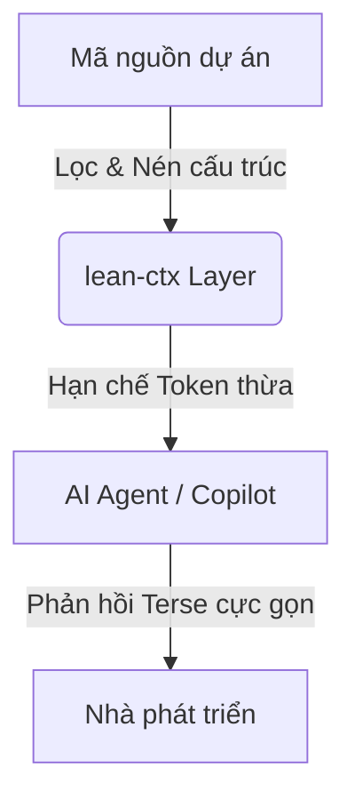

# Phần 1: Giới thiệu về lean-ctx — Công cụ Tối ưu hóa Context

> [!NOTE]
> Tài liệu này được biên soạn để phục vụ cho buổi thuyết trình (speech) về giải pháp tối ưu hóa Token và Context trong lập trình cùng AI.

---

## 1. Vấn đề lớn nhất khi code cùng AI: "Cơn ác mộng" trôi Context
Khi làm việc với các Trợ lý Lập trình AI (như Gemini, Claude, Cursor, Cline...), có 2 vấn đề lớn thường gặp:
1. **Token Bloat (Phình to Token):** AI phải đọc đi đọc lại toàn bộ code của các file lớn mỗi khi có thay đổi nhỏ. Một file `1000 dòng` có thể tiêu tốn **hàng chục ngàn Token** cho mỗi câu hỏi.
2. **Chi phí & Tốc độ:** Token càng nhiều, phản hồi của AI càng chậm và chi phí API càng tăng cao.

---

## 2. Giải pháp: lean-ctx là gì?
**lean-ctx** là một **Lớp Kỹ thuật Context lai (Hybrid Context Engineering Layer)** hoạt động như một bộ lọc thông minh nằm giữa công cụ AI và mã nguồn của bạn.

### Điểm cốt lõi của lean-ctx:
* **Tiết kiệm 60% – 99% lượng Token** thông qua cơ chế lưu đệm (caching) và nén đầu ra.
* **Đọc hiểu cấu trúc thay vì đọc chữ:** Trích xuất cây cú pháp (AST) thay vì nạp toàn bộ file text.
* **Tự động nén đầu ra của CLI:** Các lệnh Git, Docker, npm... khi chạy qua AI sẽ được rút gọn tối đa trước khi đưa vào ngữ cảnh.

---

## 3. Các tính năng nổi bật nhất
* **Caching thông minh (Cached Re-reads):** Khi AI đọc lại một file đã xem trước đó, dung lượng tiêu thụ giảm từ toàn bộ nội dung file xuống chỉ còn **~13 Token** (khóa định danh duy nhất).
* **Đa chế độ đọc (Flexible Read Modes):** Hỗ trợ chuyển đổi linh hoạt giữa `full`, `map` (sơ đồ phụ thuộc), `signatures` (chữ ký hàm/AST) và `entropy` (lọc thông tin quan trọng).
* **Bảng điều khiển trực quan (Dashboard):** Giao diện Web hiển thị trực tiếp lượng USD và Token bạn đã tiết kiệm được theo thời gian thực.
